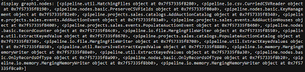

= Notes:

* Anything callable can be added in a bonobo chain as argument (nodes).
* \\__init__.py includes initialization of graph (for each event there is a chain that is put in the bonobo graph)
* UtilityHelper is in \\__init__.py
* _LOD_OBJECT
* *_CROM_FACTORY*
    ** [.small]#get_crom_object#
    ** [.small]#Add_crom_data#
* [.small]#self.helper.make_proj_uri#
* And helpers in general
* [.small]#vocab.register_instance#
* [.small]#vocab.register_vocab_class#
    . How to tell if an instance or a class is missing from crom?
        .. Cromulent has some flags like
            ... okay to use?
            ... okay for multiple?

What do those services do? (linkedart.py)
[source,python]
----
'make_la_person': MakeLinkedArtPerson(),
'make_la_lo': MakeLinkedArtLinguisticObject(),
'make_la_hmo': MakeLinkedArtHumanMadeObject(),
'make_la_org': MakeLinkedArtOrganization(),
----

* Cromulent
    ** *CromObjectMerger*
    ** Scenario: +
    
        *** [.small]#Duplicate record#
        *** [.small]#One different attribute#
        *** [.small]#It merges the two records and adds the attribute#

