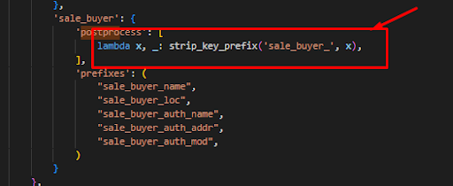

= Postprocessing questions:

Make targets invoke scripts which handle the post-processing:

[none]
* *sales*
[none]
    ** *- salesdata*
[none]
        *** *- salespipeline*
[none]
            **** - sales.py +
            # writes post_sale_rewrite_map.json
[none]
        *** *salespostprocessing*
[none]
            **** *salespostsalerewrite*
[none]
* *salespostsalefilelist*

//-
* *scripts/find_matching_json_files* +
# finds any JSON files containing URIs in post_sale_rewrite_map.json and collects matching filenames in post-sale-matching-files.txt
* *scripts/rewrite_post_sales_uris.py* +
# for every file in post-sale-matching-files.txt, canonicalizes URIs with +
[red]#post_sale_rewrite_map.json#

*postprocessing_rewrite_uris*

* *scripts/rewrite_uris_to_uuids_parallel.py* +
# replace URIs that start with 'tag:getty.edu,2019:digital:pipeline:REPLACE-WITH-UUID:' with UUID URIs
* *scripts/coalesce_json.py* +
# renames files based on their top-level .id value, merging when necessary (this can occur because of the *post-sale URI canonicalization*)
* *scripts/remove_meaningless_ids.py* +
# this is probably not needed anymore, but removes non-top-level .id values from JSON files for certain paths
* *scripts/reorganize_json.py* +
# Move JSON wherever necessary to ensure all files are located in the appropriate output sub-folders

*post_sale_rewrite_map.json* looks like:

[sourcre,json]
----
{ 
"tag:getty.edu,2019:digital:pipeline:REPLACE-WITH-UUID:sales#OBJ,B-116,0002,1806-07-28": 
"tag:getty.edu,2019:digital:pipeline:REPLACE-WITH-UUID:sales#OBJ,F-55,0100,1803-05-11", 

"tag:getty.edu,2019:digital:pipeline:REPLACE-WITH-UUID:sales#OBJ,B-116,0008,1806-07-28": 
"tag:getty.edu,2019:digital:pipeline:REPLACE-WITH-UUID:sales#OBJ,B-41,0001,1802-07-26", 

"tag:getty.edu,2019:digital:pipeline:REPLACE-WITH-UUID:sales#OBJ,B-116,0015,1806-07-28": 
"tag:getty.edu,2019:digital:pipeline:REPLACE-WITH-UUID:sales#OBJ,F-55,0060,1803-05-11", 

"tag:getty.edu,2019:digital:pipeline:REPLACE-WITH-UUID:sales#OBJ,B-116,0035,1806-07-28": 
"tag:getty.edu,2019:digital:pipeline:REPLACE-WITH-UUID:sales#OBJ,F-55,0068,1803-05-11", 

"tag:getty.edu,2019:digital:pipeline:REPLACE-WITH-UUID:sales#OBJ,B-116,0043,1806-07-28": 
"tag:getty.edu,2019:digital:pipeline:REPLACE-WITH-UUID:sales#OBJ,Br-57,0026,1801-07-23", 

"tag:getty.edu,2019:digital:pipeline:REPLACE-WITH-UUID:sales#OBJ,B-116,0045,1806-07-28": 
"tag:getty.edu,2019:digital:pipeline:REPLACE-WITH-UUID:sales#OBJ,B-300,0001,1818-07-15" 
}
----
/*/\\__init__.py : +

pipeline/util/\\__init__.py : +
list of functions for post processing

Results: +
Pipeline.counters

rewriting and coalesce_json both use *CromObjectMerger* +
[disc]
* GEORGE BRUSEKER
* Load to dev +
_ah gotcha_ +
_so they have set it up in a weird way_ +
_once you are logged in_ +
_and assuming you have rights_ +
_then_ +
_my typical process_ +
_is to move the zip packages created to test the tickets from my computer_ +
_to the dev_ +
_into this folder:_ +
_/arches/arches_provenance/data_ +
_there you will find all the files that have been created to test tickets already_ +
_keeping them in one spot makes it easy to rerun them_ +
_Then I ssh into the server_ +
_I move to the arches provenance directory ( I realize this is unecessary, but I like habits)_ +
_/arches/arches_provenance_ +
_and then all the usual commands can be used_ +
_but they have to be run like this:_ +
_/usr/bin/arches load_jsonld_ +
_where 'load_jsonld' is replaced with your desired arches command_ +
_typically the only thing I do in the server is load the data from the zips using that command_ +
_and sometimes delete the instances from a model or models_